# DevOps Lab - Jenkins Installation Guide

## Author
**Gurmehr Singh Gulati**  
**500101995**  
**R2142220078**  
**Full Stack AI B1-Hons**

---

## Overview
In this lab, we cover how to install and configure **Jenkins**, an open-source automation server that facilitates continuous integration and continuous delivery (CI/CD). We walk through the installation steps for Jenkins on Windows using **WSL** and Docker.

---

## Prerequisites
- **Windows Subsystem for Linux (WSL)** installed
- **Docker Desktop** installed and running
- **Basic terminal knowledge**

Refer to [Lab 2](lab_2.md) for setting up WSL and Docker.

---

## Installation:

Run the command below in your terminal to launch Jenkins:

```bash
docker run -p 8080:8080 -p 50000:50000 --restart=on-failure -v jenkins_home:/var/jenkins_home jenkins/jenkins
```
### *Explanation of Command:*

- `-p 8080:8080` maps Jenkins UI to your browser at `localhost:8080`.  
- `-p 50000:50000` is used to connect with Jenkins agents.  
- `--restart=on-failure` ensures Jenkins restarts automatically if it crashes.  
- `-v jenkins_home:/var/jenkins_home` mounts a volume to retain Jenkins data.  
- `jenkins/jenkins` is the official Jenkins Docker image.

---

### Jenkins Not Found – Installation Begins

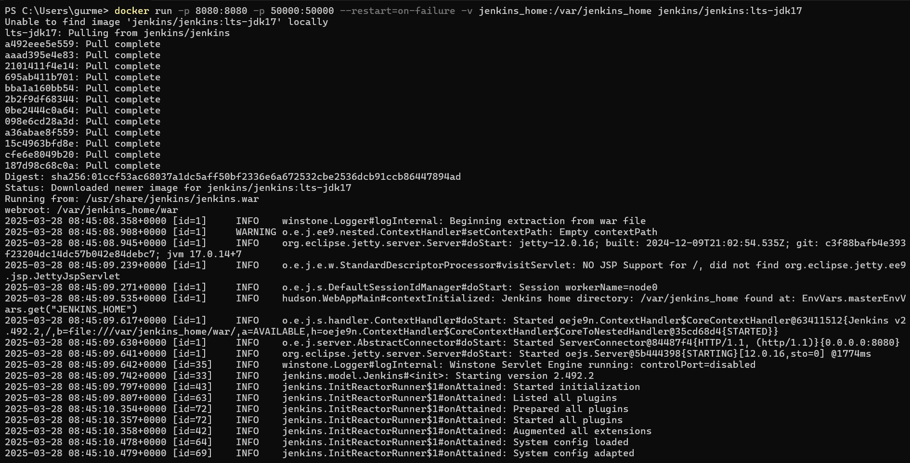

**Initial Admin Password:** `41a6c115e0e84c62a807d94c4e9a4032`  
**Password Location:** `/var/jenkins_home/secrets/initialAdminPassword`

Now, open [localhost](http://localhost) in your browser on port 8080. You’ll see the password input screen:

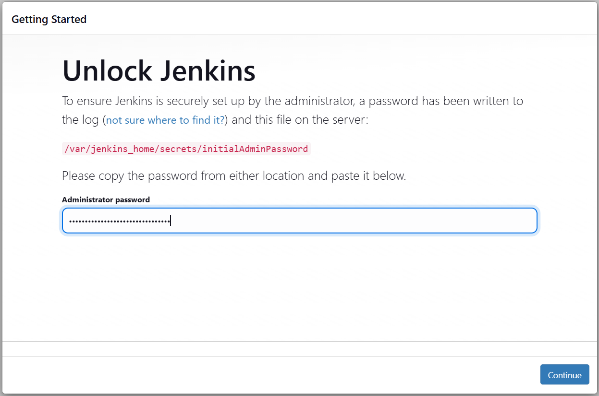

---


Jenkins will prompt you to install the **recommended plugins**.

### *Execution Steps:*

- Click on *“Install suggested plugins”* when prompted.  
  This installs frequently used plugins like Git, Pipeline, etc.

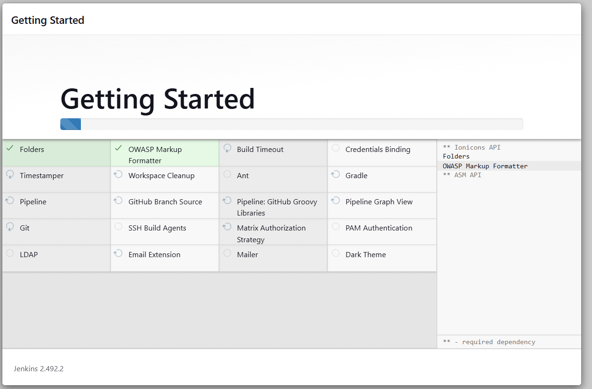
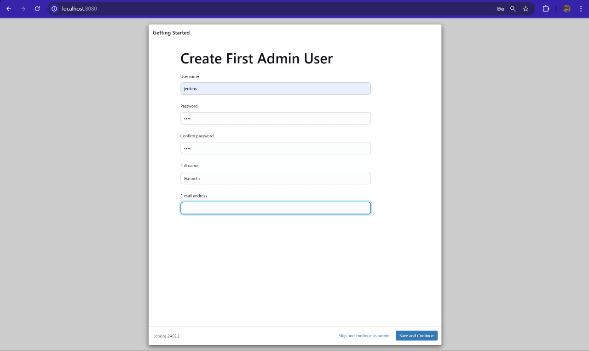
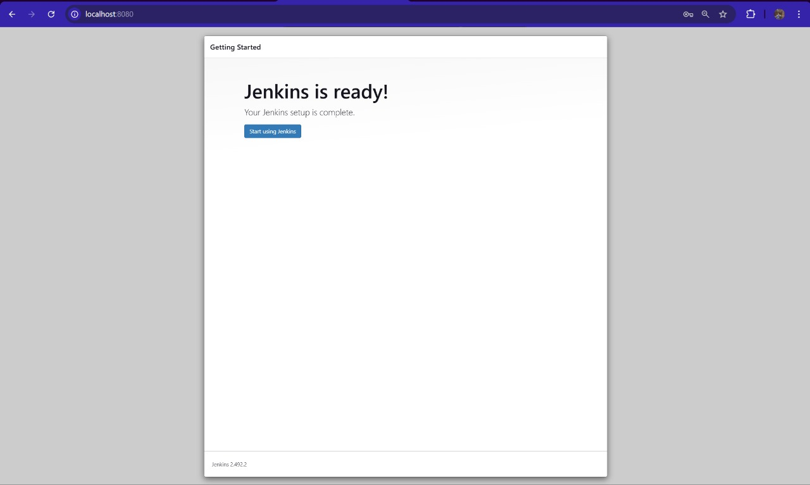

---

Once installation completes, you'll be taken to the **Jenkins Dashboard**.
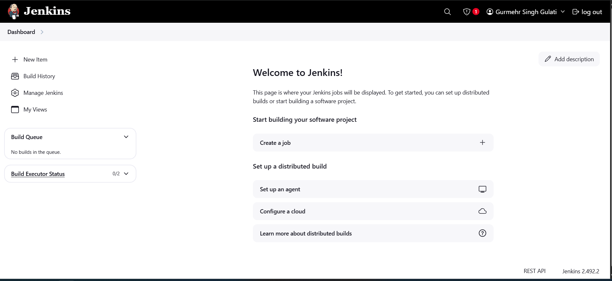

### *Execution Steps:*

- After installing plugins and creating the first admin user (image skipped), you land on the dashboard.
- From here, you can begin building jobs and pipelines.


---

After creating a **Pipeline job**, click **"Build Now"** to run it.

### *Execution Steps:*

1. Click *“New Item”*.  
2. Enter a job name.  
3. Select *Pipeline* and click OK.  
4. Scroll to the *Pipeline* section.  
5. Choose *Scripted Pipeline*.  
6. Delete all default stages except `result`.  
7. Click *Apply* and then *Build Now*.

  
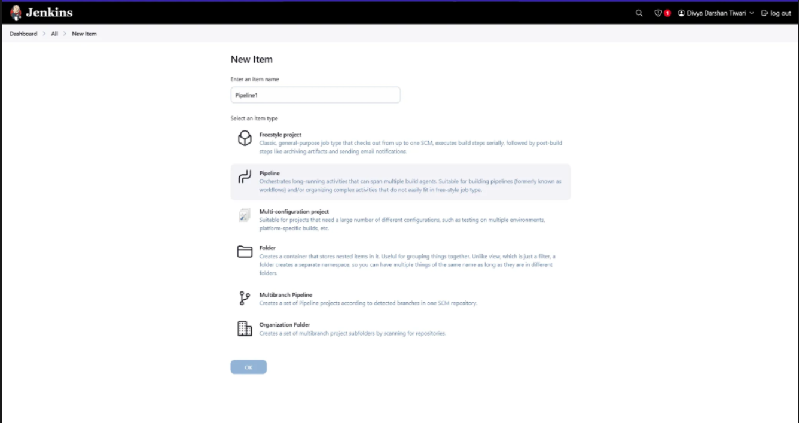
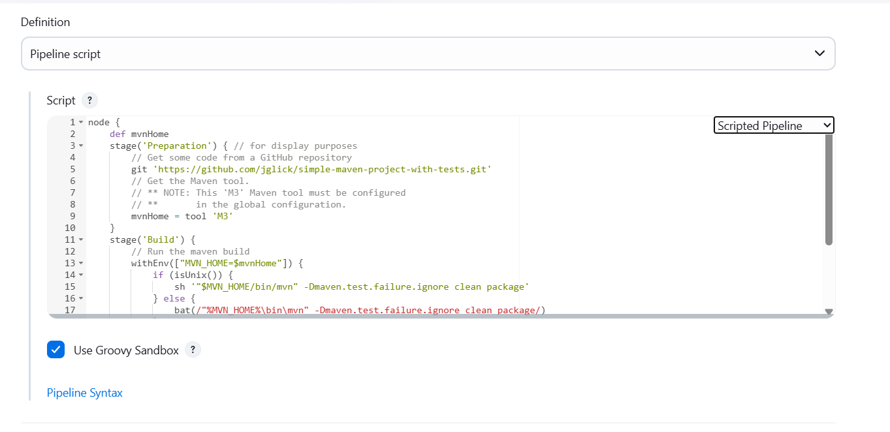
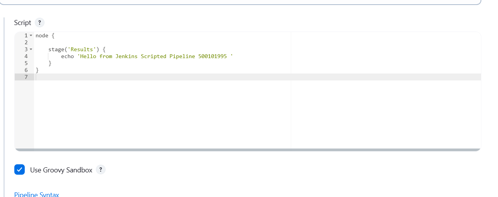

---

This initially gives an empty result screen:

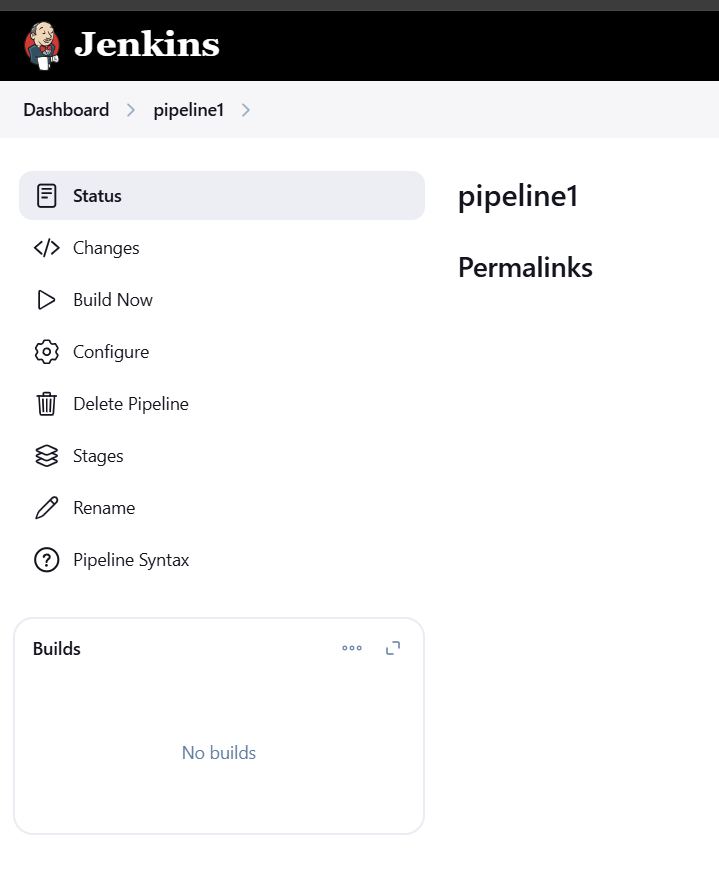

Clicking **Build Now** triggers a pipeline execution:

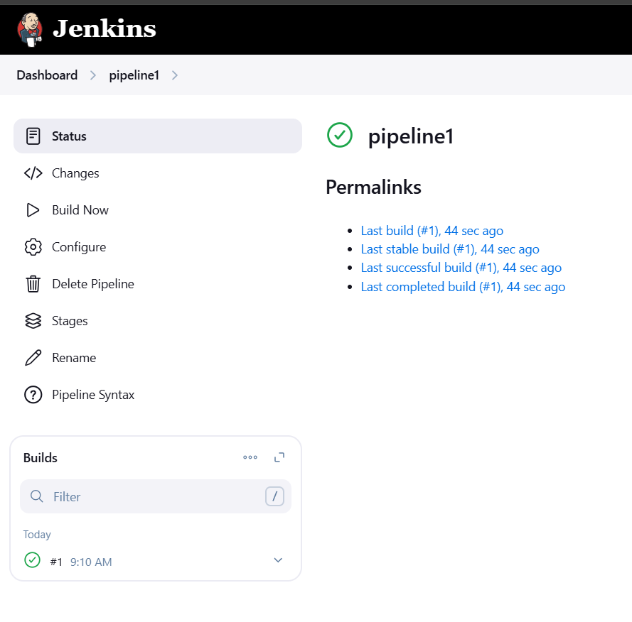

Click on the build hash under **Build History**:

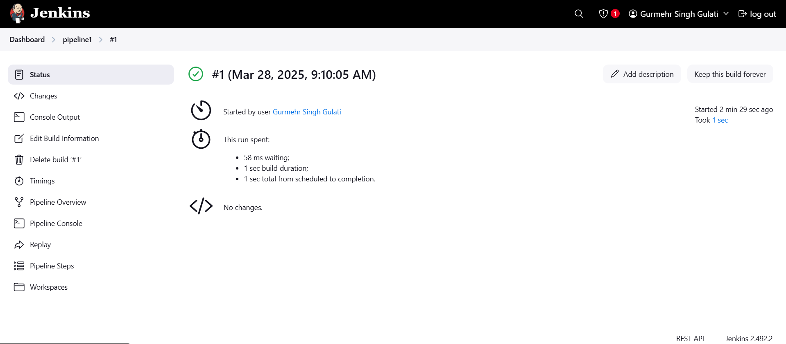

Navigate to the pipeline view:

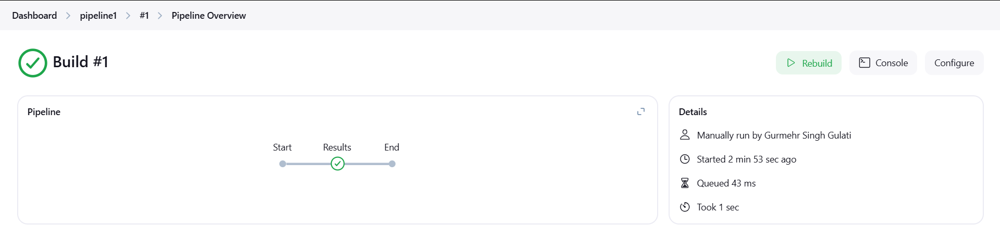

Console log:

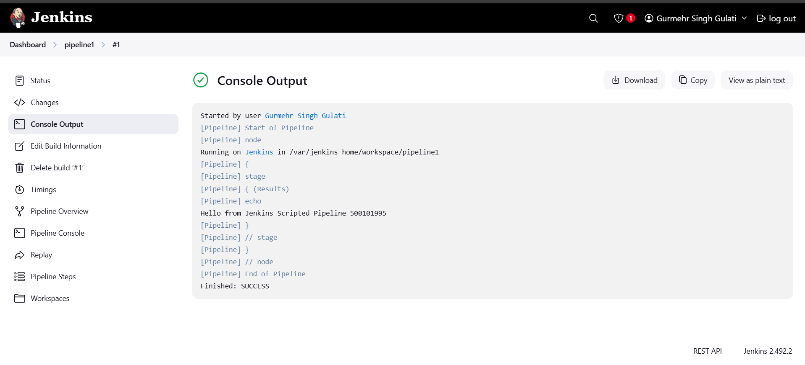

---

### *Declarative Pipeline Setup:*

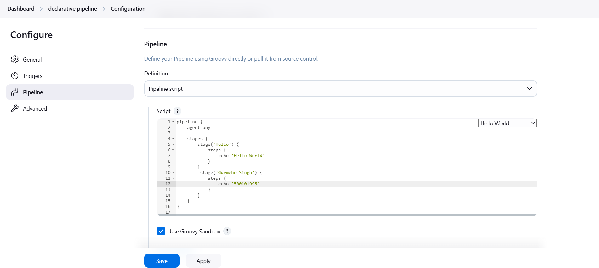

### *Execution Steps:*

1. Click *“New Item”*.  
2. Enter a job name.  
3. Select *Pipeline* and click OK.  
4. Go to the *Pipeline* section.  
5. Select the *Hello World* option.  
6. Use the following script:

```groovy
pipeline {
    agent any
    stages {
        stage('Hello') {
            steps {
                echo 'Hello World'
            }
        }
        stage('Gurmehr Singh') {
            steps {
                echo '500101995'
            }
        }
    }
}
```

7. Click *Save*.  
8. Click *Build Now* to run the pipeline.


---

You are now checking the build history and logs.

### *Execution Steps:*

1. On the left panel, click the build number (e.g., #1) under *Build History*.  
2. This shows you logs, status, and pipeline details.

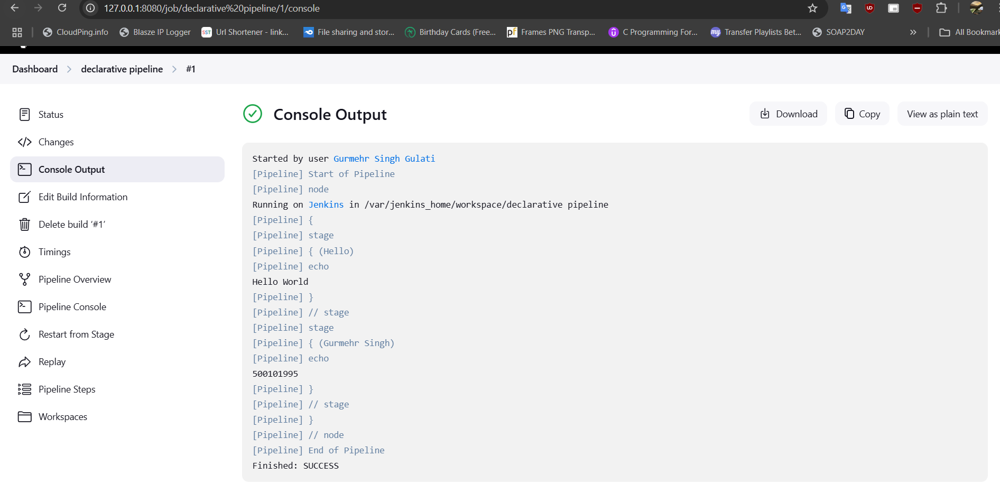

---

## Creating a Pipeline Using Jenkins

### 1️⃣ *Prepare Your Git Repository*

- Ensure the `Jenkinsfile` is present in the root of your GitHub or Git repository.  
  Repository Link: [GitHub Repo](https://github.com/gurmehr04/fastapi-dockerize-jenkins)

- Copy the repository URL.

---

### 2️⃣ *Open Jenkins Dashboard*

- Visit [http://localhost:8080](http://localhost:8080/)  
- Login if prompted.


---

### 3️⃣ *Create a New Item*

1. Click *“New Item”*.  
2. Provide a job name.  
3. Choose *Pipeline* as the project type.  
4. Click *OK*.

---

### 4️⃣ *Configure Pipeline with SCM*

1. Scroll to the *Pipeline* section.  
2. Under *Definition*, choose **Pipeline script from SCM**.  
3. Set *SCM* to **Git**.  
4. Paste your GitHub repository URL.  
   - Set credentials if required.  
5. In *Script Path*, type the Jenkinsfile name (e.g., `jenkinsfile`).

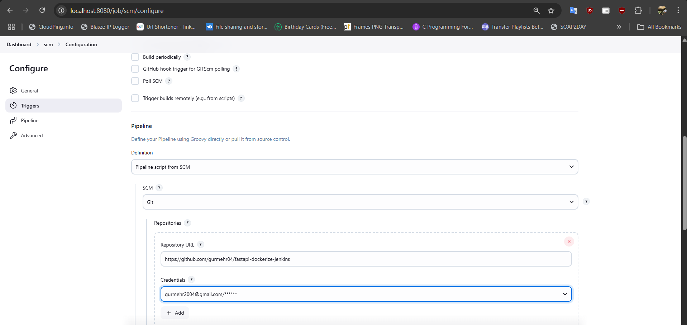

---

### 5️⃣ *Save and Build*

1. Click *Save*.  
2. Click *“Build Now”* on the job page.  
3. Jenkins will:  
   - Clone the Git repo  
   - Search for Jenkinsfile  
   - Execute the pipeline step by step

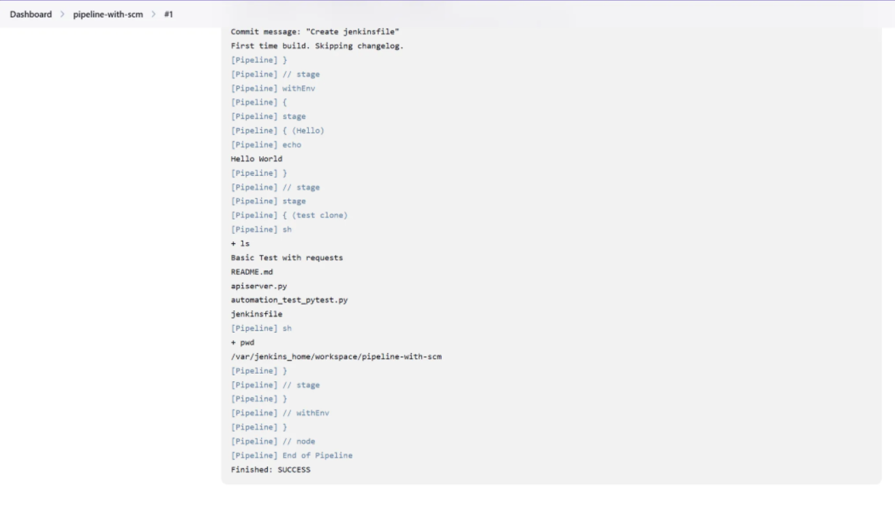
